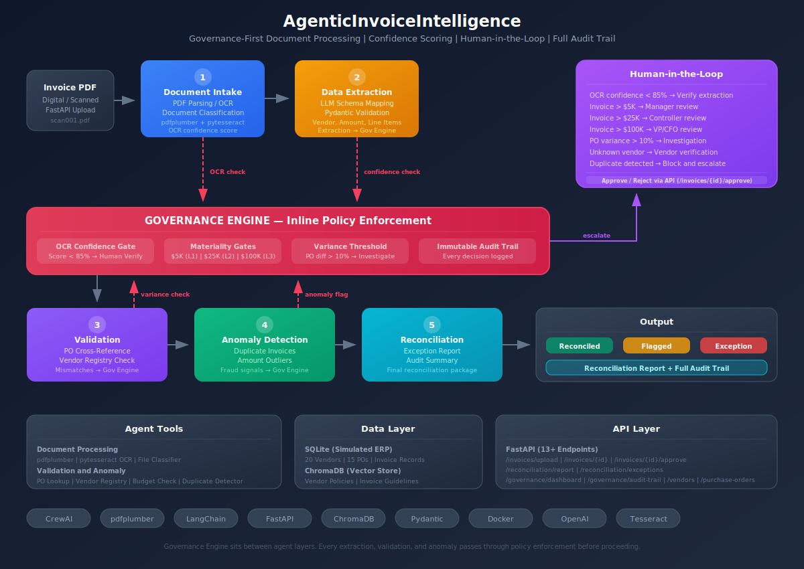

# Agentic Invoice Intelligence

A governance-first, multi-agent invoice processing system built with CrewAI and FastAPI. Five specialised AI agents collaborate to extract, validate, detect anomalies, and reconcile invoices  with a governance engine that enforces business rules inline at every pipeline stage.

---

## Architecture



The system follows a left-to-right pipeline: raw documents enter through the API, pass through five sequential agents, and emerge as structured reconciliation reports. The governance engine runs between every agent stage, not as a post-processing step, ensuring high-risk invoices are caught early.

---

## The Five-Agent Pipeline

| Stage | Agent | Responsibility |
|-------|-------|----------------|
| 1 | Document Intake Specialist | Classifies document type, runs OCR if needed, assesses extraction quality |
| 2 | Data Extraction Analyst | Extracts structured fields: vendor, dates, line items, totals, PO reference |
| 3 | Validation Officer | Cross-references vendor registry, matches PO, checks math and variance |
| 4 | Anomaly Detection Specialist | Detects duplicates, statistical outliers, unknown vendors, date anomalies |
| 5 | Reconciliation Manager | Synthesises findings, assigns final status, generates reconciliation report |

---

## Governance-First Design

Most automation systems apply rules at the end. This system applies them **inline between every agent stage**.

The governance engine evaluates six rules in priority order:

1. **OCR confidence gate** -- Blocks low-quality extractions before they propagate (threshold: 85%)
2. **Duplicate detection** -- Blocks reprocessing of invoices seen within the last 90 days
3. **Unknown vendor hold** -- Holds invoices from vendors not in the approved registry
4. **PO variance flag** -- Flags invoice amounts that deviate from the PO by more than 10%
5. **Materiality gates** -- Routes invoices to the correct approval level based on amount
6. **Agent confidence gate** -- Escalates to human review when any agent confidence falls below 70%

### Approval Authority Matrix

| Amount Threshold | Escalation Level |
|-----------------|------------------|
| Under $5,000 | Auto-routed (no escalation) |
| $5,000 - $24,999 | L1 Manager |
| $25,000 - $99,999 | L2 Controller |
| $100,000+ | L3 VP / CFO |
| Any anomaly or low confidence | Human Review queue |

Every governance decision is written to an **append-only audit log**. Nothing is deleted or modified. This forms the compliance trail.

---

## Tech Stack

| Layer | Technology | Purpose |
|-------|-----------|---------|
| Agent orchestration | CrewAI 0.80 | Multi-agent pipeline coordination |
| LLM | OpenAI GPT-4o | Reasoning and extraction |
| API | FastAPI 0.115 | REST endpoints with automatic OpenAPI docs |
| Data models | Pydantic v2 | Strict validation and JSON serialisation |
| Document parsing | pdfplumber + pytesseract | PDF text extraction and OCR |
| Vector store | ChromaDB | Semantic similarity for anomaly detection |
| Database | SQLite (PostgreSQL-ready) | Invoice, vendor, PO, and audit records |
| Report generation | ReportLab | PDF reconciliation reports |

---

## Getting Started

### Prerequisites

- Python 3.11 or higher
- [Tesseract OCR](https://github.com/tesseract-ocr/tesseract) installed on the system
- An OpenAI API key

### Installation

```bash
git clone <repo-url>
cd AgenticInvoiceIntelligence

python -m venv .venv
source .venv/bin/activate   # Windows: .venv\Scripts\activate

pip install -r requirements.txt
```

### Configuration

```bash
cp .env.example .env
# Edit .env and set OPENAI_API_KEY
```

### Run the API

```bash
python run_server.py
```

The API will be available at `http://localhost:8000`. Interactive docs at `http://localhost:8000/docs`.

### Run with Docker

```bash
docker compose up --build
```

### Run Tests

```bash
pytest tests/ -v
```

---

## API Endpoints

| Method | Endpoint | Description |
|--------|----------|-------------|
| `POST` | `/invoices/upload` | Upload a PDF invoice for processing |
| `GET` | `/invoices` | List all processed invoices |
| `GET` | `/invoices/{id}` | Get a specific invoice by ID |
| `GET` | `/invoices/{id}/audit` | Get audit trail for a specific invoice |
| `POST` | `/invoices/{id}/approve` | Human approval of an escalated invoice |
| `POST` | `/invoices/{id}/reject` | Human rejection of an invoice |
| `GET` | `/reconciliation/report` | Full reconciliation report for the current batch |
| `GET` | `/reconciliation/exceptions` | List invoices requiring human attention |
| `GET` | `/governance/dashboard` | Governance metrics and KPIs |
| `GET` | `/governance/audit-trail` | System-wide audit trail |
| `GET` | `/vendors` | List all vendors in the approved registry |
| `GET` | `/purchase-orders` | List all active purchase orders |
| `GET` | `/health` | API health check |

---

## Project Structure

```
AgenticInvoiceIntelligence/
├── src/
│   ├── agents/              # CrewAI agent definitions (5 agents)
│   ├── tasks/               # Task definitions for each agent
│   ├── tools/               # Custom tools (validation, anomaly, DB lookup)
│   ├── governance/
│   │   ├── engine.py        # Inline governance rule evaluator
│   │   └── audit.py         # Audit trail helpers
│   ├── models/
│   │   └── schemas.py       # Pydantic v2 domain models (single source of truth)
│   ├── data/
│   │   └── database.py      # SQLite layer with PostgreSQL-compatible patterns
│   ├── api/
│   │   └── routes.py        # FastAPI route handlers (13 endpoints)
│   ├── docs/                # Internal documentation generators
│   └── crew.py              # Pipeline orchestrator
├── tests/
│   ├── conftest.py          # Shared fixtures (fresh DB per test)
│   ├── test_models.py       # Pydantic schema tests
│   ├── test_governance.py   # Governance engine tests
│   ├── test_database.py     # Database function tests
│   └── test_api.py          # FastAPI endpoint tests
├── docs/
│   ├── PROJECT_OVERVIEW.md  # Business context and design narrative
│   ├── architecture.svg     # Pipeline architecture diagram
│   └── architecture.png     # PNG version of architecture diagram
├── sample_invoices/         # Simulated PDF invoices for testing
├── Dockerfile               # Multi-stage container build
├── docker-compose.yml       # Compose with environment variable wiring
├── pyproject.toml           # Project metadata and pinned dependencies
├── requirements.txt         # Flat dependency list
├── .env.example             # Environment variable template
└── run_server.py            # Development server entry point
```

---

## Key Design Decisions

### Governance is inline, not post-hoc

The governance engine runs between every agent stage. An invoice with low OCR confidence is stopped before extraction. A duplicate is blocked before validation. A high-value invoice is escalated before reconciliation. This prevents error propagation and reduces wasted compute.

### Confidence scores drive escalation

Every agent reports a confidence score alongside its output. Scores below 0.70 trigger automatic human escalation regardless of other governance rules. This ensures the system fails safely: it escalates when uncertain rather than guessing.

### Immutable audit trail

Audit records are append-only. The system never updates or deletes them. Every governance decision, agent action, and human override is logged with a timestamp, the actor, and the before/after state. This is the foundation of the compliance story.

### Pydantic v2 as the contract layer

All domain models are defined in a single file (`schemas.py`) and shared across the API, agents, and governance engine. This eliminates the risk of different layers making different assumptions about the same data.

### SQLite with a clear migration path

SQLite is used for the reference implementation because it requires zero infrastructure. The query patterns use standard SQL with parameterised inputs, and the connection layer is abstracted behind functions that accept a `db_path` argument. Swapping in PostgreSQL requires changing one connection string and one import.

---

## Simulated Data

The system ships with 20 vendor records and 15 purchase orders covering realistic enterprise categories: cloud infrastructure, software licensing, professional services, marketing, and facilities. Sample invoices cover:

- Normal approved invoices matching PO amounts
- High-value invoices triggering L2 and L3 escalation
- Duplicate invoice scenarios
- Unknown vendor scenarios
- Low OCR confidence scenarios

The system is fully runnable without any external data source.

---

## Production Considerations

| Concern | Current (Reference) | Production Path |
|---------|--------------------|--------------------|
| Database | SQLite | PostgreSQL via SQLAlchemy async |
| File storage | Local filesystem | Object storage (S3 or equivalent) |
| Pipeline execution | Synchronous | Message queue (SQS, RabbitMQ) |
| Secrets | Environment variables | Secrets manager |
| Observability | Log output | Prometheus metrics + structured logs |
| Auth | None | OAuth2 / RBAC on approval endpoints |
| Scaling | Single process | Horizontal with stateless governance engine |

---

## License

MIT
